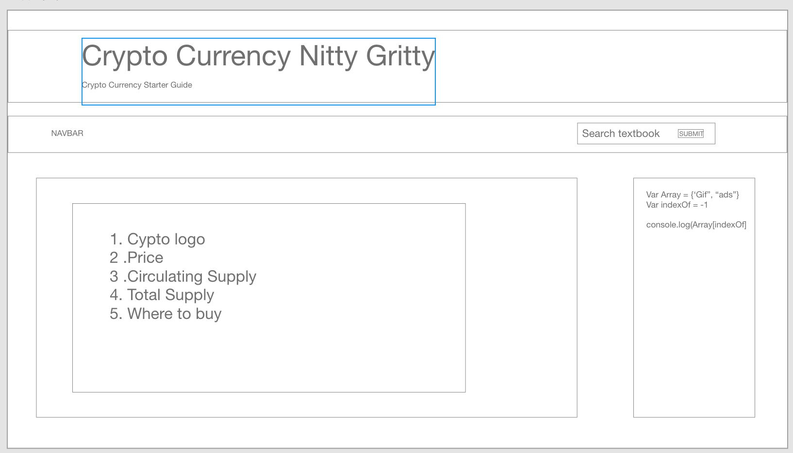

# CryptoCurrency Nitty Gritty
The users should be able to search for any CryptoCurrency and retrieve data related to current price, circulating supply, total supply and where to purchase.

## Team Members
Rodney James, Jay Guevara, Nicholas Leone

### APIs to be used
1. coingecko
2. giphy

### Tasks
1. Creating Folders and files for project
2. Grab all relevant API’s needed for project
3. Assign tasks to group members
4. Sketch out design for the HTML layout
5. Make firebase Database-Code javascript logic

### Sketch

